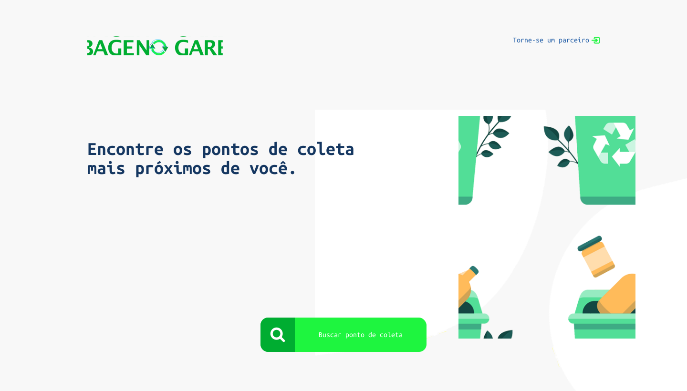

## 💻 Sobre o Projeto
No Garbage é um marketplace para conectar usuários que se preocupam com o descarte correto de seus resíduos, e empresas que possuem pontos de coleta.

---

## 🎨 Design - (Inspirado em ECOLETA - [Rocketseat](https://rocketseat.com.br/))

---

## 🧰 Principais Ferramentas
* Node.js
* TypeScript
* TypeORM
* SQLite
* CORS
* JWT

---

## 📝 Licença
Este projeto está sob a licença [MIT](./LICENSE)
